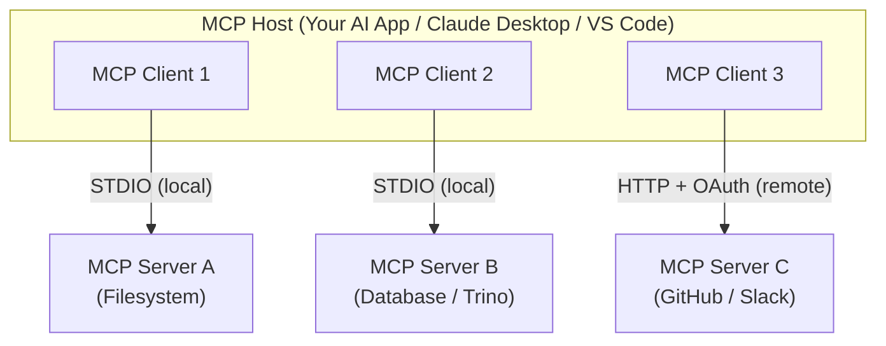
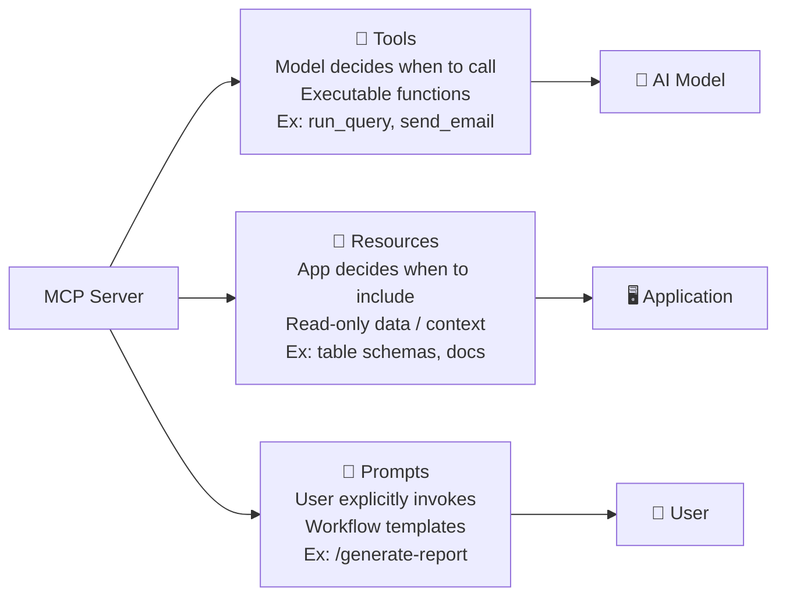
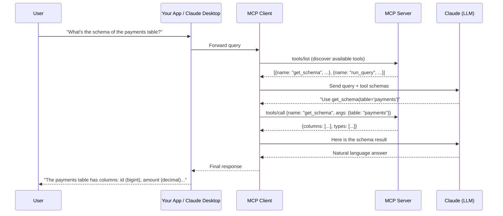
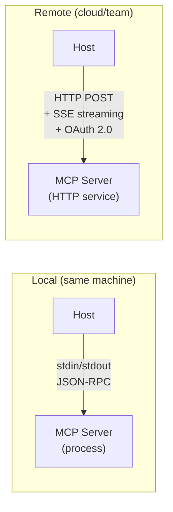
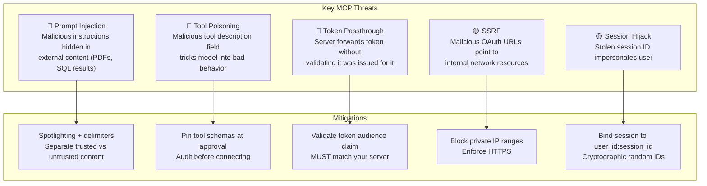
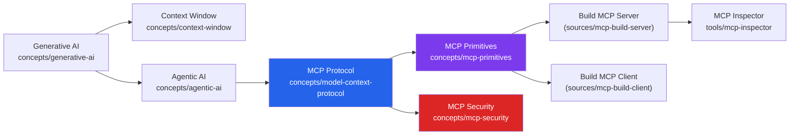

# Domain: Model Context Protocol (MCP)

> **Prerequisites**: [[concepts/generative-ai]] → [[concepts/agentic-ai]] → this domain
>
> **What you'll understand after this**: How AI models connect to the outside world in a standardized, maintainable way — and how to build that connection yourself.

---

## The Problem: Every Integration Was Custom

Imagine you're building a chat assistant that needs to answer questions about your company's data. It needs to query a database, read documentation, check a calendar, and send a Slack message. Without a standard, you'd write four separate integrations — each with its own tool schemas, error handling, authentication, and maintenance burden.

Now multiply that by every company building AI, every database vendor, every SaaS tool. You get M × N custom integrations — every client needs to know about every server, in every combination.

**MCP solves this with a standard**: one protocol, one interface. Any AI application that speaks MCP can talk to any MCP server. The ecosystem becomes M + N instead of M × N.

> **Analogy**: MCP is to AI what USB-C is to devices. Before USB-C, every device had its own cable. After USB-C, one standard works everywhere. Before MCP, every AI integration was custom code. After MCP, one standard works everywhere.

---

## Architecture: Who Does What

MCP defines three roles that interact through a standardized protocol:



| Role | What it is | Examples |
|------|-----------|---------|
| **MCP Host** | The AI application. Creates and manages clients. | Claude Desktop, Claude Code, VS Code, Cursor |
| **MCP Client** | One per server. Handles the protocol, capability negotiation, message routing. | Created by the host automatically |
| **MCP Server** | Exposes capabilities to clients. Can be local or remote. | Filesystem server, GitHub server, your custom Trino server |

**Key insight**: The host never talks to servers directly — always through a dedicated client. This is what enables one host to talk to many servers simultaneously without them interfering with each other.

---

## The Three Primitives: What Servers Expose

Every MCP server can expose up to three types of capabilities. Understanding which primitive to use for what is the core design decision when building a server.



### Tools — the model acts
Tools are executable functions. The model reads the tool's description and decides autonomously whether to call it and with what arguments. Think of them as functions your AI can invoke.

```python
@mcp.tool()
async def run_trino_query(query: str, catalog: str = "hive") -> str:
    """Execute a read-only SQL query against Trino.
    
    Args:
        query: The SQL query to execute
        catalog: Trino catalog name (default: hive)
    """
    # FastMCP generates the JSON Schema from type hints + docstring
    return await execute_query(query, catalog)
```

### Resources — context flows in
Resources are passive data sources. The application controls when to include them in the model's context — no action taken, just information provided. URI-addressed, like a file system.

```
trino://hive/payments/transactions       → schema definition for transactions table
file:///docs/eos-model-spec.md           → EOS YAML specification
calendar://my-calendar/this-week         → current week's meetings
```

### Prompts — user guides the workflow
Prompts are parameterized workflow templates the user explicitly invokes. They encode expertise about how to use the server's tools and resources together for a complex task.

```
/generate-eos-model table=transactions catalog=hive
  → guides Claude through: read schema → check existing models → generate YAML → validate
```

---

## How a Request Flows

Here's what happens from the moment a user types a question to when they see an answer:



**What the model sees**: At each step, Claude sees your query AND a list of available tool schemas (names + descriptions + input shapes). It decides which tool to call — or none at all — based on what's needed.

---

## Two Transports: Local vs Remote

How the client and server communicate depends on where the server runs:



| | STDIO | Streamable HTTP |
|--|-------|----------------|
| **Where server runs** | Same machine as host | Anywhere (cloud, team server) |
| **Communication** | stdin/stdout streams | HTTP POST + Server-Sent Events |
| **Auth** | Environment variables | OAuth 2.0 (bearer tokens) |
| **Clients per server** | 1 | Many |
| **Use when** | Dev, personal tools, Claude Desktop | Team tools, production, public servers |
| **Example** | `npx @modelcontextprotocol/server-filesystem` | GitHub MCP server (hosted by GitHub) |

---

## Security: AI-Specific Threats

MCP introduces attack vectors that don't exist in traditional software. The ones you need to know:



**The rule of thumb**: Think of community MCP servers like npm packages. Trust official providers (GitHub's own server, AWS's own server). Audit community servers before connecting.

---

## Building Your First MCP Server: The Pattern

With the Python SDK, a working server is ~50 lines:

```python
from mcp.server.fastmcp import FastMCP

mcp = FastMCP("my-server")

@mcp.tool()
async def get_schema(table: str, catalog: str = "hive") -> dict:
    """Get column definitions for a Trino table.
    
    Args:
        table: Table name
        catalog: Trino catalog (default: hive)
    """
    return await trino_client.describe_table(catalog, table)

@mcp.tool()  
async def run_query(sql: str) -> list[dict]:
    """Execute a read-only SQL query against Trino."""
    return await trino_client.execute(sql)

if __name__ == "__main__":
    mcp.run(transport="stdio")
```

Then add it to Claude Desktop's config:
```json
{
  "mcpServers": {
    "my-server": {
      "command": "python",
      "args": ["/absolute/path/to/server.py"]
    }
  }
}
```

---

## Learning Dependency Map

Where MCP sits in the broader knowledge graph:



**Learning order**: Generative AI → Agentic AI → MCP Protocol → Primitives → build a server → test with Inspector → connect to Claude Desktop.

---

## Concepts in This Domain

- [[concepts/model-context-protocol]] — the full protocol reference
- [[concepts/mcp-primitives]] — tools, resources, and prompts in depth
- [[concepts/mcp-security]] — AI-specific threats and mitigations
- [[tools/mcp-inspector]] — the debugging tool
- [[tools/mcp-connectors]] — Claude's built-in connectors (pre-built MCP servers for popular services)
